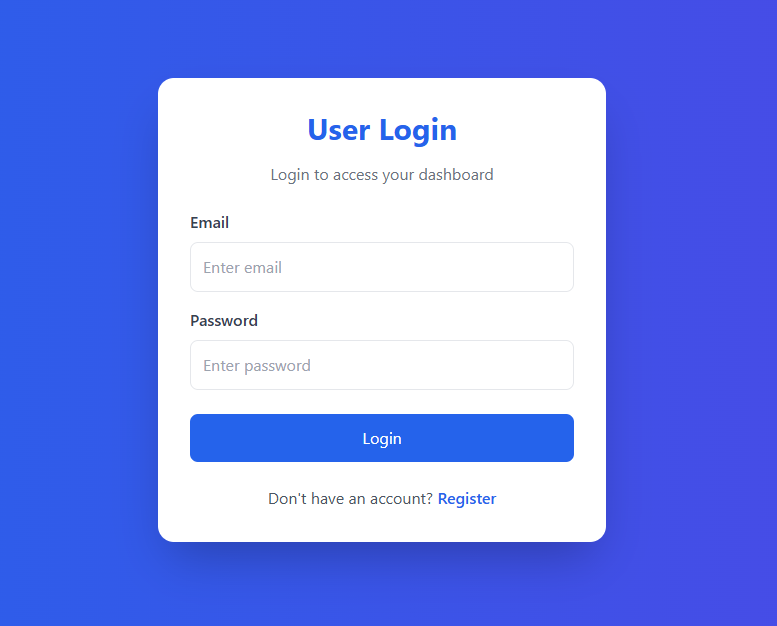
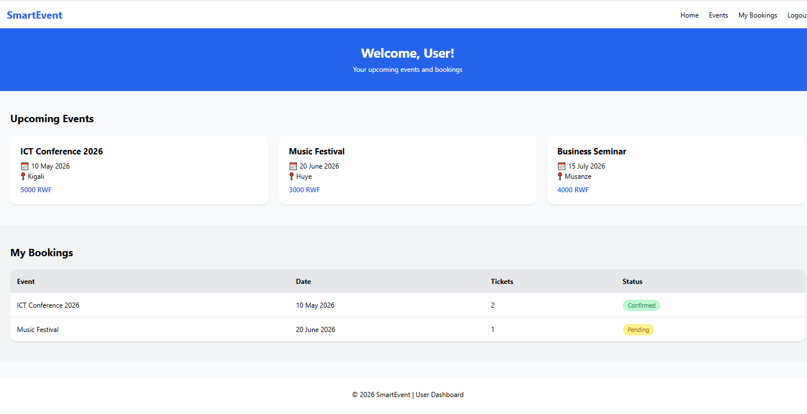

# 🎟️ SmartEvent - Project Documentation

This repository contains the frontend implementation for the **SmartEvent** platform, a localized event management system designed for the Rwandan market.

---

## 🖼️ Page Previews (Outputs)

### 1. User Registration Page
*Filename: `user_register.html`*
     
**[capture3.PNG](capture3.PNG)

---

### 2. User Login Page
*Filename: `user_login.html`*
     

---

### 3. User Dashboard
*Filename: `userdashboard.html`*
     

---

### 4. Admin Login Page
*Filename: `admin_login.html`*
     
**[capture.](capture.PNG)

---

### 5. Admin Dashboard
*Filename: `Admindashboard.html`*
     
**[image.png](image.png)

---

## 🚀 Project Overview

- **User Flow**: Registration ➡️ Login ➡️ Event Discovery (Kigali, Huye, Musanze).
- **Admin Flow**: Secure Login ➡️ Management of Events, Bookings, and Users.
- **Styling**: Built using [Tailwind CSS Utility Classes](https://tailwindcss.com).

## 🛠️ How to Run
1. Ensure you are connected to the internet to load the [Tailwind CDN](https://tailwindcss.com/installation/play-cdn).
2. Open any `.html` file directly in a modern web browser like Chrome or Firefox.
3. Use the navigation links to move between the User and Admin portals.

---
*Created for the SmartEvent Project - 2026*
